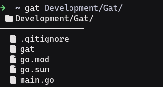
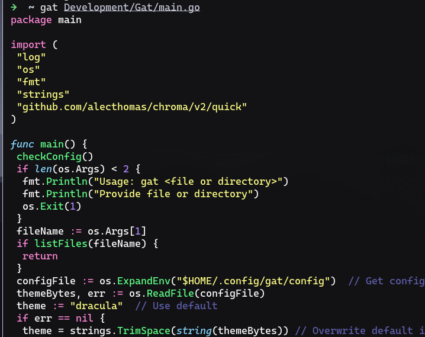

```markdown
# gat 🐱

A cat clone with syntax highlighting. Lists files and directories



## Installation

### Requirements
- Go 1.26+

### Build from source
```bash
git clone https://github.com/Gambit67/Gat
cd Gat
go build -o gat
sudo cp gat /usr/local/bin/
```

## Usage
```bash
gat filename          # view a file with syntax highlighting
gat ~/projects/      # list files in a directory
```

## Configuration
gat creates a config file at ~/.config/gat/config on first run.
Edit it to change the theme:
```bash
nano ~/.config/gat/config
```
dracula, monokai, nord, github, etc.

## Themes
Any theme from https://github.com/alecthomas/chroma is supported.
```
